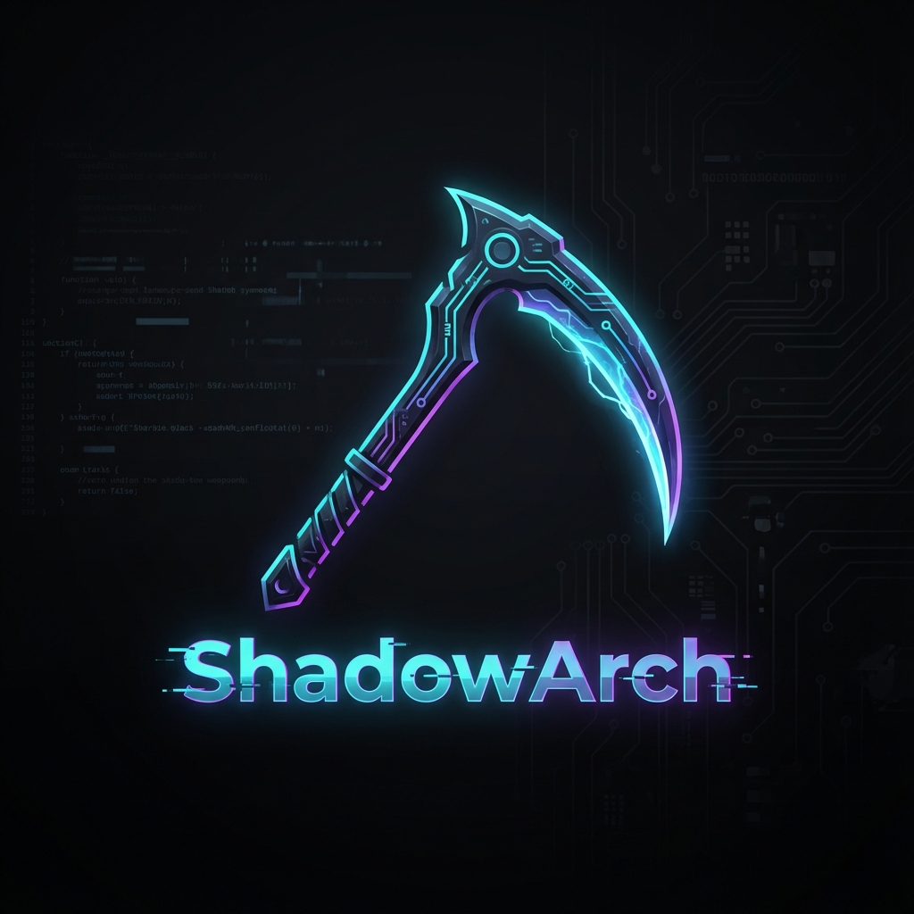

# ShadowK 025


**ShadowK 025** is a custom Arch Linux distribution designed for **Security Auditing, Pentesting, and Forensics**. It combines the raw power of Arch Linux with a pre-configured, beautiful **Cyberpunk/Purple** aesthetic (Hyprland) and a complete arsenal of security tools (Kali-Parity + Custom PenTools).

---

## 🚀 Features

*   **🛡️ Complete Arsenal**: Includes Metasploit, Burp Suite, Hydra, Sqlmap, Wireshark, and more out of the box.
*   **🔧 Custom Tools**: Automatically integrates [PenTools](https://github.com/FNAl3/PenTools) for advanced enumeration and attacks.
*   **🎨 Cyberpunk Aesthetic**:
    *   **Window Manager**: Hyprland (Wayland) with animations and blur.
    *   **Theme**: Dracula (GTK) & Cyberpunk Neon colors.
    *   **Look**: Custom "Kama" Boot Splash and Login Screen.
*   **⚡ Interactive Installer**: Custom Python script (`install_script.py`) to install the OS in minutes without manual commands.

---

## 📂 Project Structure Explained

Here is what each file/folder does:

| File / Folder | Purpose |
| :--- | :--- |
| **`profiledef.sh`** | **The Identity**. Defines the ISO name (`shadowk`), version, and file permissions. |
| **`packages.x86_64`** | **The Arsenal**. List of all packages to be installed (Kernel, Hyprland, Security Tools). |
| **`prepare_iso.sh`** | **The Chef**. Downloads external assets (Dracula Theme, PenTools code) before building. |
| **`syslinux/`** | **The Bootloader**. Contains the boot menu configuration and the custom **boot logo** (`kama_shadowarch.png`). |
| **`airootfs/`** | **The File System**. Files here are overlayed onto the OS. |
| `└── root/install_script.py` | **The Installer**. Interactive script to partition disks and install the system. |
| `└── etc/skel/` | **The Configs**. Dotfiles (Waybar, Hyprland, Kitty) that are copied to the new user. |

---

## 🛠️ How to Build (Create the ISO)

To create your own ISO file to burn onto a USB, follow these steps on an Arch Linux system:

### 1. Prepare the Environment
Ensure you have the necessary tools installed (archiso, git, curl, unzip):
```bash
sudo pacman -S archiso git curl unzip
```

### 2. Prepare Assets
Run the helper script to download the Theme and PenTools:
```bash
chmod +x prepare_iso.sh
./prepare_iso.sh
```
*Successfully downloaded themes will be placed in `airootfs/usr/share/themes`.*

### 3. Compile
Build the ISO (this takes 10-20 minutes depending on your internet/CPU):
```bash
sudo mkarchiso -v -w /tmp/archiso-work -o out .
```

### 4. Locate ISO
The final file will be in the `out/` directory.

---

## 🧪 Deployment / Boot Scenarios

### 🖥️ VirtualBox (Standard Testing)
1. **Create VM**: New > Type: Linux > Version: Arch Linux (64-bit).
2. **Resources**:
    *   **RAM**: Minimum 4GB (8GB Recommended).
    *   **CPU**: 2 Cores.
    *   **Video Memory**: 128MB + Enable 3D Acceleration.
3. **Settings**: Go to System > Motherboard > **Enable EFI** (Required for Hyprland).
4. **Boot**: Mount the generated ISO (from `out/shadowk-....iso`) and start.

### 🔌 Live USB (Real Hardware)
1. **Flash**: Write the ISO to a USB stick using **Etcher** or **Rufus** (Select **DD Mode** if asked).
2. **BIOS/UEFI**:
    *   Disable **Secure Boot**.
    *   Set Boot Priority to USB.
3. **Boot**: Select ShadowArch from the boot menu.

---

## 💾 How to Install (Target Machine)

1.  **Boot**: Insert the USB and boot. You will see the **ShadowK Boot Menu** (with the Kama Logo).
2.  **Login**: Use user `root`. No password is required for the Live environment.
3.  **Install**:
    Run the text-based installer:
    ```bash
    python /root/install_script.py /root/config_example.yaml
    ```
4.  **Configure**:
    The script will ask for:
    *   **Hostname**: Name of the machine (e.g., `ShadowBox`).
    *   **User/Pass**: Your new user credentials.
    *   **Disk**: Which drive to erase and install to (default `/dev/sda`).

5.  **Reboot**: Remove the USB and restart. You will be greeted by SDDM and the Hyprland desktop.

---

## ⌨️ Keybindings (Hyprland)

| Key | Action |
| :--- | :--- |
| `Super + Q` | Open Terminal (Kitty) |
| `Super + C` | Kill Window |
| `Super + M` | Exit Hyprland (Logout) |
| `Super + E` | File Manager (Dolphin/Thunar) |
| `Super + V` | Toggle Floating |
| `Super + Space` | App Launcher (Wofi) |

---
